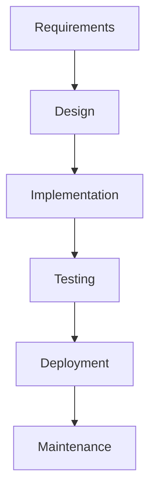
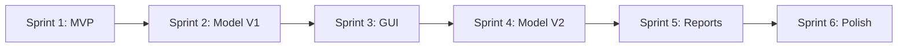
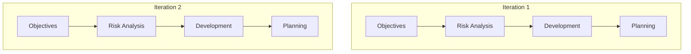

# ConcreteSpot - Development Methodology Analysis

## Overview
This document analyzes how ConcreteSpot could be developed using different software development methodologies.

---

## 1. Waterfall Model

### Phases

### Application to ConcreteSpot

| Phase | Activities | Duration |
|-------|-----------|----------|
| **Requirements** | Define damage types (crack, spalling, corrosion, rebar), severity levels, input formats, output requirements | 2 weeks |
| **Design** | Architecture design, YOLOv8 selection, GUI mockups, database schema | 3 weeks |
| **Implementation** | Model training, GUI development, report generation | 8 weeks |
| **Testing** | Unit tests, integration tests, model validation | 2 weeks |
| **Deployment** | Packaging, installer creation, documentation | 1 week |

### Pros & Cons for This Project

| Pros | Cons |
|------|------|
| Clear milestones | No flexibility for model improvements |
| Well-documented | Can't iterate on mAP until testing phase |
| Easy to manage | Dataset issues discovered late |

---

## 2. Agile Model (Scrum)

### Sprint Structure

### Sprint Breakdown

| Sprint | Goals | Deliverables |
|--------|-------|--------------|
| **1** | Working detection on sample images | CLI tool, basic model |
| **2** | Train on curated dataset | mAP@50 > 60% |
| **3** | GUI implementation | Tkinter interface |
| **4** | Dataset expansion + retraining | mAP@50 > 75% |
| **5** | Reports, batch processing | PDF/Excel export |
| **6** | Testing, documentation | Release candidate |

### Agile Ceremonies
- **Daily Standup**: Progress on model training, blockers
- **Sprint Review**: Demo detection on new images
- **Retrospective**: What augmentations worked, dataset quality issues

### Pros & Cons for This Project

| Pros | Cons |
|------|------|
| Iterative model improvement | Harder to plan training time |
| Early user feedback | Frequent deliverables overhead |
| Flexible to add features | Documentation may lag |

---

## 3. Spiral Model

### Spiral Phases

### Iterations for ConcreteSpot

| Iteration | Objective | Risk Analysis | Development | Outcome |
|-----------|-----------|---------------|-------------|---------|
| **1** | Proof of concept | Is YOLO suitable? Dataset available? | Train on 1K images | Validate approach |
| **2** | Baseline model | Annotation quality? Class imbalance? | Train on 5K images | mAP@50 > 65% |
| **3** | Production model | Generalization? Edge cases? | Train on 20K images | mAP@50 > 80% |
| **4** | Deployment | Performance? User acceptance? | GUI + packaging | Release |

### Risk Mitigation Examples
- **Risk**: Poor crack detection → **Mitigation**: Clean dataset, remove conflicting annotations
- **Risk**: Model overfitting → **Mitigation**: Data augmentation, early stopping
- **Risk**: Slow inference → **Mitigation**: Use YOLOv8n (smallest variant)

### Pros & Cons for This Project

| Pros | Cons |
|------|------|
| Risk-aware development | Complex to manage |
| Suitable for ML uncertainty | More documentation overhead |
| Allows architecture pivots | Longer overall timeline |

---

## Recommended Approach: Hybrid Agile-Spiral

For ML projects like ConcreteSpot, a hybrid approach works best:
- **Spiral** for model development (risk-based iterations)
- **Agile** for application features (sprints for GUI, reports)

---

## Research Paper Potential

### 1. Novel Contributions
- **Multi-source dataset curation** for concrete damage (Roboflow + dacl10k + pseudo-labeling)
- **Data cleaning methodology** using model predictions to identify annotation conflicts
- **Severity classification** using area-based metrics from detection outputs
- **Explainable AI** with GradCAM integration for infrastructure inspection

### 2. Potential Publication Venues
| Venue | Focus | Impact |
|-------|-------|--------|
| **IEEE Access** | Open access, engineering applications | Moderate |
| **Automation in Construction** | Civil engineering + AI | High |
| **MDPI Applied Sciences** | Multidisciplinary | Moderate |
| **Computer Vision and Image Understanding** | CV methods | High |
| **ICIP/CVPR Workshop** | Conference publication | High prestige |

### 3. Paper Structure
1. **Introduction**: Infrastructure monitoring challenges
2. **Related Work**: YOLO variants, damage detection methods
3. **Dataset Curation**: Multi-source merging, cleaning methodology
4. **Methodology**: YOLOv8n architecture, training strategy
5. **Experiments**: Ablation studies, comparison with baselines
6. **GradCAM Analysis**: Explainability for civil engineers
7. **Severity Classification**: Area-based heuristics
8. **Conclusion**: Production deployment insights

### 4. Key Metrics for Publication
- mAP@50 comparison across training iterations
- Per-class performance analysis
- Inference speed benchmarks
- Real-world validation imagery
